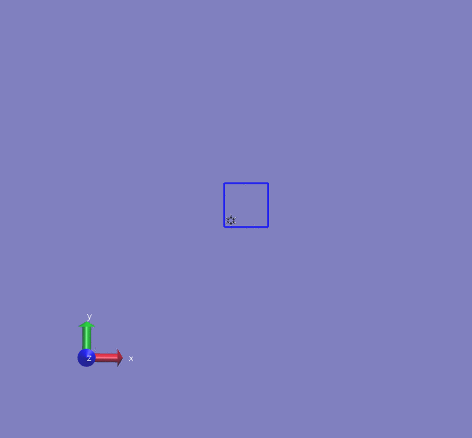
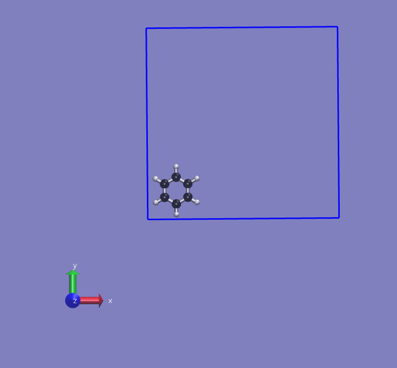
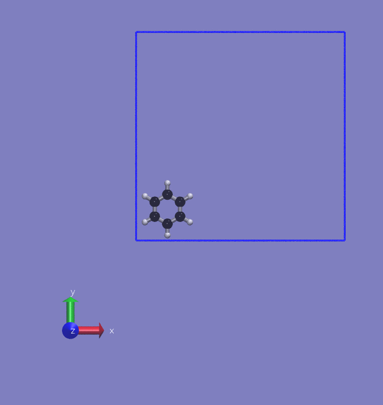

Converting Periodic Trajectory to Non-Periodic Trajectory
=========================================================
In order to calculate atomic distances properly the periodicity of the system must be considered.
For example, when we want to calculate center of mass of a molecule during a simulation,
we must be careful when the molecule is passing through the boundaries of the box.
Using cartesian coordinates would be wrong in that case since some part of the molecule
would be at one edge of the box whereas other part would be at the other edge.

A solution to this problem is to convert all coordinates to non-periodic cartesian coordinates.
This means that we need to figure out when the atoms are passing the boundaries and apply reverse
periodic boundary conditions.

Implementation
--------------
Here is a pseudo code to do that:

```
simulation_cell = [30, 30, 30]
FOR each atom a:
  modifier = [0, 0, 0]
  FOR each frame f (f = 1 to ALL):
    current_position  -> 3D position of atom a at frame f
    previous_position -> 3D position of atom a at frame f - 1
    new_position = current_position
    FOR each dimension (i = 0 to 2):
      d = current_position[i] - previous_position[i]
      IF d > unit_cell_edge * 0.5:
        # There is a - direction change
        modifier[i] = modifier[i] - simulation_cell[i]
      ELSE IF d[i] <= -unit_cell[i] * 0.5:
        # There is a + direction change
        modifier[i] = modifier[i] + simulation_cell[i]
      END IF
      new_position[i] = new_position[i] + modifier[i]
    END FOR
  save new_position
  END FOR
END FOR
```

Here is the Python implementation:

```python
def non_periodic_coordinates(coordinates, simulation_box):
    """Convert periodic simulation coordinates to non-periodic coordinates.
    *** ORTHORHOMBIC CELLS ONLY ***

    Args:
        - coordinates (ndarray): 3D list of atomic coordinates for given number of frames
        - simulation_box (list): Dimensions of the simulation box: [a, b, c]

    Returns:
        - ndarray: 3D list of non-periodic coordinates
    """
    n_frames, n_atoms, _ = np.shape(traj.coordinates)
    nonp_coordinates = np.empty((n_frames, n_atoms, 3))
    nonp_coordinates[0] = coordinates[0].copy()
    for a in range(n_atoms):
        modifier = np.zeros(3)
        for f in range(1, n_frames):
            coor = traj.coordinates[f][a].copy()
            prev_coor = traj.coordinates[f - 1][a]
            for i in range(3):
                dist = coor[i] - prev_coor[i]
                if dist > sim_box[i] * 0.5:
                    modifier[i] -= sim_box[i]
                elif dist <= -sim_box[i] * 0.5:
                    modifier[i] += sim_box[i]
                coor[i] += modifier[i]
            nonp_coordinates[f][a] = coor
    return nonp_coordinates
```

Tests
-----
### Linear motion in x-direction

<table>
  <tr>
    <th>Periodic</th>
    <th>Non-Periodic</th>
  </tr>
  <tr>
    <th>
      <a href="assets/img/benzene-x-p.gif">
        
      </a>
    </th>
    <th>
      <a href="assets/img/benzene-x-np.gif">
        
      </a>
    </th>
  </tr>
</table>

### Linear motion in x and y directions

<table>
  <tr>
    <th>Periodic</th>
    <th>Non-Periodic</th>
  </tr>
  <tr>
    <th>
      <a href="assets/img/benzene-xy-p.gif">
        
      </a>
    </th>
    <th>
      <a href="assets/img/benzene-xy-np.gif">
        
      </a>
    </th>
  </tr>
</table>
